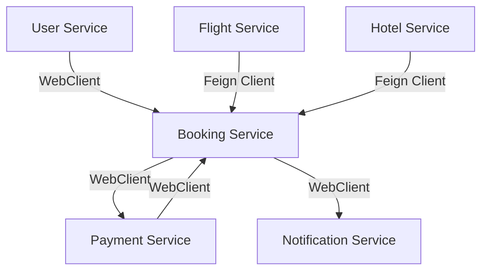
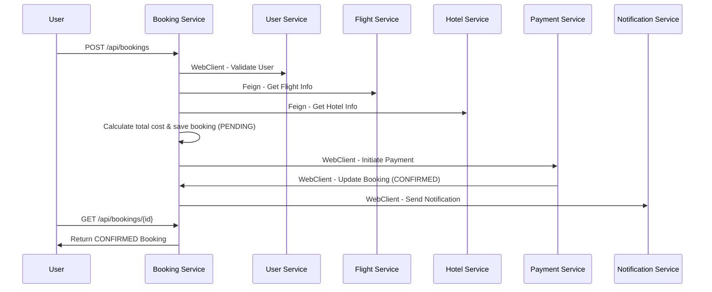

# ✈️ Smart Travel Booking Platform
### *Inter-Service Communication Using REST API, Feign Client, and WebClient*

---

## 📘 Overview

The **Smart Travel Booking Platform** is a microservice based system that demonstrates inter-service communication using **Spring Boot**, **Spring Cloud OpenFeign**, and **Spring WebClient**.

It allows users to:
- Register and manage their details
- View available flights and hotels
- Make bookings that combine flight + hotel reservations
- Process payments
- Receive notifications once booking is confirmed

This project highlights how modern microservices communicate seamlessly without using deprecated tools like `RestTemplate`.

---

## 🧱 Microservice Architecture

smart-travel-platform/

├── user-service/ # Manages user profiles

├── flight-service/ # Manages flight details

├── hotel-service/ # Manages hotel details

├── booking-service/ # Orchestrates booking workflow

├── payment-service/ # Handles payments and confirms booking

└── notification-service/ # Sends notifications to users

---

## ⚙️ Technologies Used

| Layer | Technology |
|-------|-------------|
| Language | **Java 17** |
| Framework | **Spring Boot 3 / Spring Cloud 2025.1.0 (Oakwood)** |
| Communication | **REST API, Feign Client, WebClient** |
| Database | **H2 (In-memory)** |
| Build Tool | **Maven** |
| IDE | IntelliJ IDEA |
| Testing | Postman |

---

## 🌐 Service Ports

| Service | Port | Description |
|----------|------|-------------|
| user-service | 8081 | User management |
| flight-service | 8082 | Flight management |
| hotel-service | 8083 | Hotel management |
| booking-service | 8084 | Booking orchestration |
| payment-service | 8085 | Payment confirmation |
| notification-service | 8086 | Notification sending |

---

## 🧩 Microservice Communication Flow

### 🔗 Communication Rules
| From | To | Method | Technology |
|------|----|---------|------------|
| Booking Service | User Service | REST | WebClient |
| Booking Service | Flight Service | REST | Feign Client |
| Booking Service | Hotel Service | REST | Feign Client |
| Booking Service | Payment Service | REST | WebClient |
| Booking Service | Notification Service | REST | WebClient |
| Payment Service | Booking Service | REST | WebClient |

✅ No deprecated technologies like `RestTemplate` were used.

---

## 🧭 Architecture Diagram

## Explanation:

- The Booking Service acts as the orchestrator.

- It fetches user, flight, and hotel details before creating a booking.

- Payment is processed asynchronously and updates booking status.

- Notification Service informs the user after confirmation.

## 🧠 Booking Flow Summary

###  Step-by-Step Process

 ### 1.User sends booking request

      {
            "userId": 1,
            "flightId": 1,
            "hotelId": 1,
            "travelDate": "2025-01-10"
      }

### 2.Booking Service

  - Validates user via WebClient 
              
              (GET /api/users/{id})

  - Checks flight availability via Feign Client

  - Checks hotel availability via Feign Client

  - Calculates total cost

  - Saves booking with status PENDING

  - Calls Payment Service via WebClient

### 3.Payment Service

  - Simulates payment success

  - Calls Booking Service via WebClient
               
        PUT /api/bookings/{id}/status?status=CONFIRMED

     

### 4.Booking Service

  - Updates booking to CONFIRMED

  - Sends a notification using WebClient to Notification Service

  

### 5.Notification Service

  - Logs message: "Booking confirmed for user 1"

  

### 6.User can fetch the final status:

      GET /api/bookings/1
      → "status": "CONFIRMED"

      
---

  # 🔍 Communication Flow Diagram

---

# 🧾 Error Handling and Validation
## ✅ Implemented Features

   - @ControllerAdvice with GlobalExceptionHandler

   - ResourceNotFoundException for missing entities

   - MethodArgumentNotValidException for input validation

   - Consistent JSON error format:

           {
             "timestamp": "2025-12-14T12:34:56.123",
             "status": 404,
             "error": "Not Found",
             "message": "User not found with id: 99",
             "path": "/api/users/99"
            }

## 💾 Database Verification (H2 Console)

Each service uses an in-memory H2 database.

  - H2 Console: http://localhost:PORT/h2-console

  - Example JDBC URLs:
 
     - User Service → jdbc:h2:mem:usersdb

     - Booking Service → jdbc:h2:mem:bookingsdb

     - Payment Service → jdbc:h2:mem:paymentsdb

Example Query

      SELECT * FROM BOOKINGS;

| ID | USER_ID | FLIGHT_ID | HOTEL_ID | TRAVEL_DATE | TOTAL_COST | STATUS    |
| -- | ------- | --------- | -------- | ----------- | ---------- | --------- |
| 1  | 1       | 1         | 1        | 2025-12-20  | 700.0      | CONFIRMED |

## 🧪 Testing with Postman

A complete Postman Collection (Smart-Travel-Platform.postman_collection.json) is included with the following tests:

| Service      | Request           | Method | Endpoint             |
| ------------ | ----------------- | ------ | -------------------- |
| User         | Create User       | POST   | `/api/users`         |
| Flight       | Create Flight     | POST   | `/api/flights`       |
| Hotel        | Create Hotel      | POST   | `/api/hotels`        |
| Booking      | Create Booking    | POST   | `/api/bookings`      |
| Booking      | Get Booking       | GET    | `/api/bookings/{id}` |
| Payment      | Simulate Payment  | POST   | `/api/payments`      |
| Notification | Send Notification | POST   | `/api/notifications` |

## 🧭 How to Run Locally

  - Install Java 17 and Maven

  - Open each service in IntelliJ

  - Run each main class:

         UserServiceApplication.java
         FlightServiceApplication.java
         HotelServiceApplication.java
         BookingServiceApplication.java
         PaymentServiceApplication.java
         NotificationServiceApplication.java

  - Check that all ports are free (8081–8086)

  - Test in Postman using the provided collection

## 🏁 Submission Package

| File                                            | Description                                                                  |
| ----------------------------------------------- | ---------------------------------------------------------------------------- |
| `README.md`                                     | Full documentation & flow explanation                                        |
| `Smart-Travel-Platform-Postman-Collection.json` | Postman collection                                                           |
| `screenshots/`                                  | Evidence of successful API calls                                             |
| GitHub Repo                                     | [smart-travel-platform ](https://github.com/Dilkyy/smart-travel-platform) |

## 🏆 Credits

Developed by ,

CHAMIKA E.L.D. – ICT/21/81

